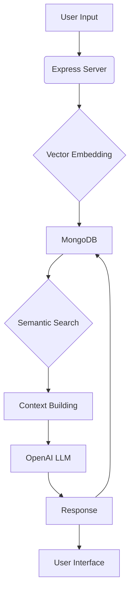
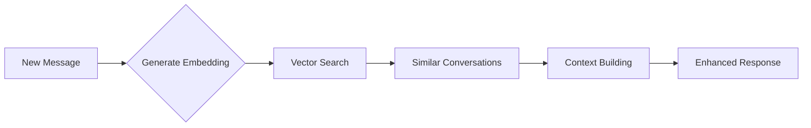
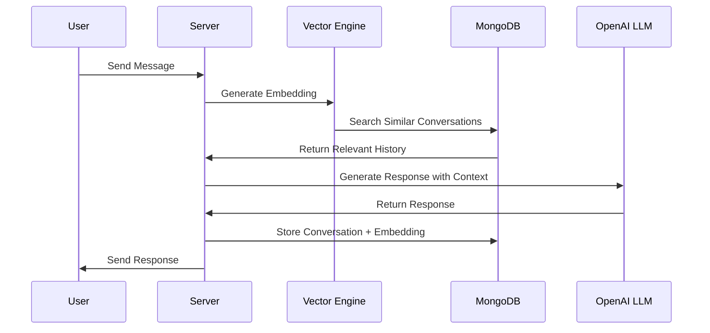
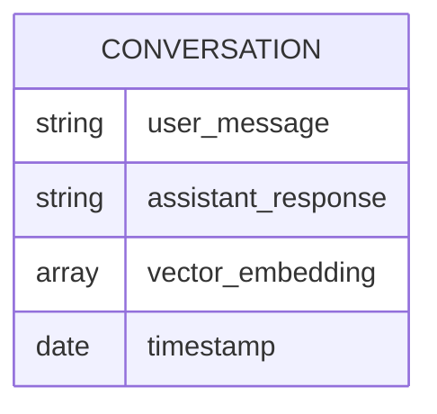

# long Term Semantic Memory For LLMs 🤖

A context-aware AI assistant that builds semantic memory from conversations, enabling personalized and historically-informed responses.

## 🧠 System Architecture

## 🌟 Key Features

### 1. Semantic Memory Storage
- Each conversation is vectorized and stored
- Maintains complete conversation history
- Enables semantic similarity search
- Automatic memory management

### 2. Vector-Based Retrieval System

### 3. Memory Architecture

| Component | Description |
|-----------|-------------|
| Vector Store | MongoDB with vector search capabilities |
| Embedding Model | OpenAI's embedding model |
| Context Window | 50 most relevant conversations |
| Storage Format | User message, Assistant response, Vector embedding, Timestamp |

## 💡 How It Works

## 🔋 System Components

### Frontend
- Real-time chat interface
- Message formatting support
- Timestamp display
- Code syntax highlighting

### Backend
- Express.js server
- MongoDB with vector search
- OpenAI API integration
- Semantic search capabilities

## 📊 Memory Management

### Storage Schema

### Vector Search Process
1. Convert new message to vector embedding
2. Search vector index for similar conversations
3. Retrieve top 50 relevant conversations
4. Build context from retrieved conversations
5. Generate contextually aware response

## 🚀 Performance

### Scalability Features
- Vector index for efficient similarity search
- Automatic cleanup of old conversations
- Optimized MongoDB queries
- Efficient context building

### Memory Efficiency
- Vector dimensionality: Based on OpenAI's embedding model
- Storage optimization: Only essential conversation data
- Index-based retrieval: Fast semantic search
- Automatic data cleanup: Maintains system performance

## 🌐 System Requirements

### Dependencies
- Node.js
- MongoDB
- OpenAI API access
- Modern web browser

### Configuration
- MongoDB connection string
- OpenAI API credentials
- Server port settings
- CORS configuration

## 📬 Contact

* Website: [shivsingh.com](https://shivsingh.com)
* Email: hi@shivsingh.com
* LinkedIn: [Shiv Singh](https://linkedin.com/in/shivsinghin)
